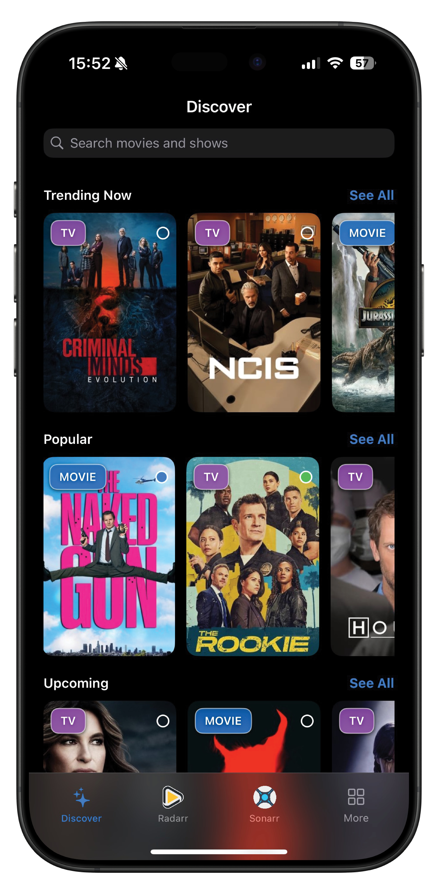
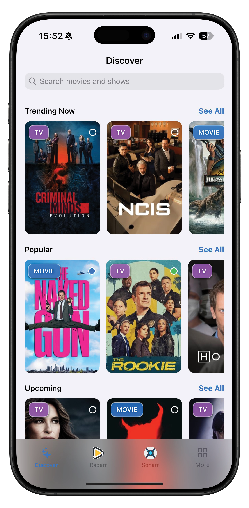

# OmniFetch App

Comprehensive documentation for configuring and using the OmniFetch application.

  
  

## App Configuration

- **[Initial Setup](settings/initial-setup.md)** - First-time app configuration and permissions

## Features

- **[Webhooks](features/webhooks.md)** - Configure webhook notifications
- **[Widgets](features/widgets.md)** - Home screen widget configuration
- **[CloudKit Sync](features/cloudkit-sync.md)** - Cross-device synchronisation setup

## Troubleshooting

- **[Common Issues](../troubleshooting/common-issues.md)** - Frequently encountered problems
- **[FAQ](../troubleshooting/faq.md)** - Questions and answers
