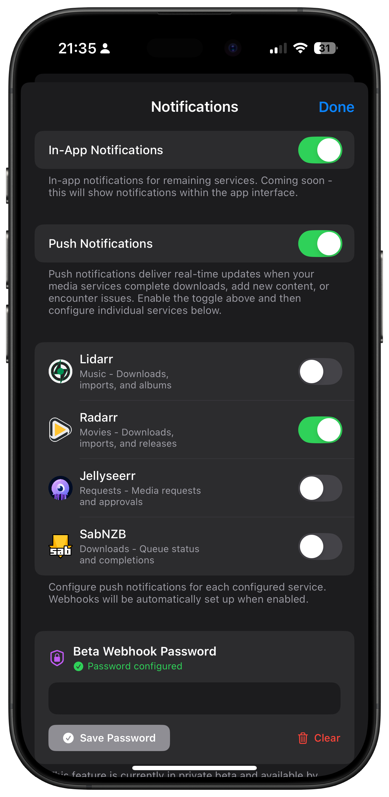
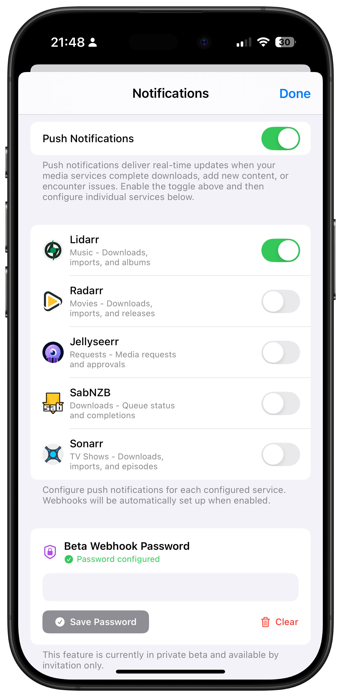
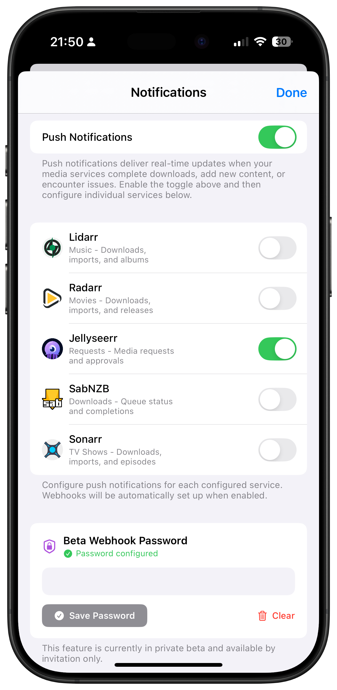
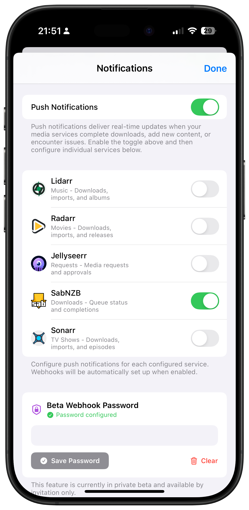

# Notification Settings

Configure push notifications and alerts for your media services.

## Global Notification Settings

Access notification settings from **Settings** → **Notification Settings**.

### Push Notifications

#### Enable Notifications
- **Master Toggle**: Enable/disable all OmniFetch notifications
- **Status**: Shows current permission status
- **Test Button**: Send a test notification

#### Private Beta Key
- **Purpose**: Enable webhook notifications (beta feature)
- **Location**: Push Notifications section
- **Entry**: Paste key provided by support
- **Validation**: Green checkmark when valid

### Notification Preferences

#### Sound Settings
- **Default Sound**: Choose global notification sound
- **Per-Service Sounds**: Override for specific services
- **Critical Alerts**: Enable for important events

#### Visual Settings
- **Badge App Icon**: Show notification count
- **Show Previews**: Display notification content
- **Group Notifications**: Stack by service type

#### Quiet Hours
- **Enable**: Set do-not-disturb periods
- **Schedule**: Configure daily quiet times
- **Override**: Allow critical notifications

## Push Notification Examples

Here are examples of what notifications look like for each service:

**Sonarr Notifications:**

**Radarr Notifications:**

**Lidarr Notifications:**

**Jellyseerr Notifications:**

**SABnzbd Notifications:**

## Service-Specific Settings

Configure notifications for each service independently.

### Sonarr Notifications

**Available Events:**
- Episode Downloaded
- Episode Grabbed
- Quality Upgraded
- Health Issues
- Series Deleted

**Configuration:**
1. Go to service settings
2. Tap "Notification Settings"
3. Toggle desired events
4. Set custom sound (optional)

### Radarr Notifications

**Available Events:**
- Movie Downloaded
- Movie Grabbed
- Quality Upgraded
- Health Issues
- Movie Added/Deleted

### Lidarr Notifications

**Available Events:**
- Album Downloaded
- Album Grabbed
- Quality Upgraded
- Artist Added/Deleted

### Jellyseerr Notifications

**Available Events:**
- Media Requested
- Request Approved/Declined
- Media Available
- Issues Created/Resolved

### SABnzbd Notifications

**Available Events:**
- Download Started/Completed
- Download Failed
- Queue Finished
- Disk Space Warnings

## Webhook Configuration (Beta)

For beta users with webhook access.

### Automatic Services

Sonarr, Radarr, and Lidarr webhooks are configured automatically when:
1. Beta key is entered
2. Service is added/saved
3. Connection test passes

### Manual Services

Jellyseerr and SABnzbd require manual configuration:

#### Generate Webhook ID
1. Go to **Settings** → **Developer**
2. Tap **Generate Webhook ID**
3. Copy the generated ID

#### Configure Service
- **Jellyseerr**: Add webhook in service web UI
- **SABnzbd**: Configure Python script with ID

## Notification Troubleshooting

### Not Receiving Notifications

1. **Check iOS Settings:**
   - Settings → Notifications → OmniFetch
   - Ensure "Allow Notifications" is ON
   - Check notification style and sounds

2. **Verify Beta Key:**
   - Settings → Notification Settings → Push Notifications
   - Confirm beta key is saved
   - Look for green validation checkmark

3. **Test Service Connection:**
   - Open service in OmniFetch
   - Pull to refresh
   - Check for error messages

### Delayed Notifications

- Check Background App Refresh is enabled
- Verify good network connectivity
- Review service webhook configuration
- Check server-side delays

### Duplicate Notifications

- Disable notifications in service web UI
- Use only OmniFetch for notifications
- Check for multiple webhook entries

## Best Practices

### Notification Management

1. **Start Conservative:**
   - Enable only essential notifications
   - Add more as needed
   - Avoid notification fatigue

2. **Use Quiet Hours:**
   - Set overnight quiet periods
   - Allow only critical alerts
   - Respect your downtime

3. **Organize by Priority:**
   - Critical: Download failures, health issues
   - Important: Downloads complete, requests
   - Informational: Grabs, quality upgrades

### Performance Optimization

- Limit active notifications to essential events
- Use grouped notifications for high-volume services
- Disable badge counts if not needed
- Configure appropriate refresh intervals