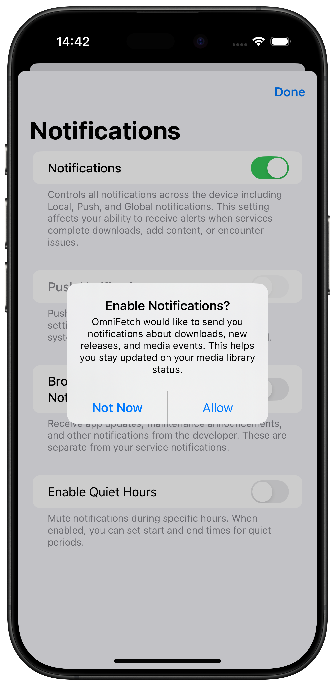
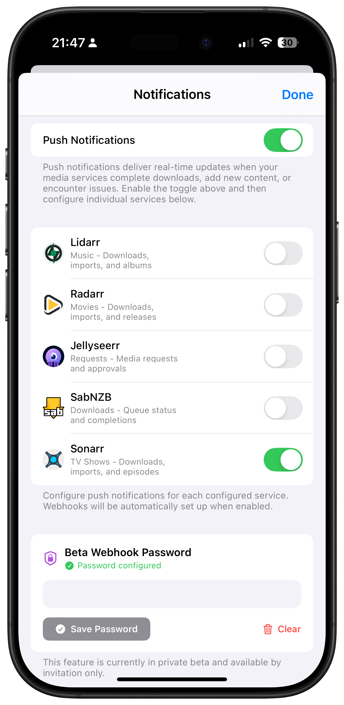

# Notifications

OmniFetch provides comprehensive notification support to keep you informed about your media services across all your Apple devices.

## Types of Notifications

### Webhook Notifications

Advanced webhook integration for real-time event delivery from your services. See the [Webhooks Guide](webhooks.md) for detailed setup instructions.

## Notification Settings

### iOS Notification Settings

Ensure OmniFetch has proper permissions in iOS Settings:

1. **Settings** → **Notifications** → **OmniFetch**
2. Enable **Allow Notifications**
3. Configure **Lock Screen**, **Notification Center**, and **Banners**
4. Set **Sounds** and **Badges** as desired
5. Choose **Notification Grouping** preference

### Push Notifications (Private Beta)

Receive instant notifications on your iPhone, iPad, and Apple TV when important events occur in your media services.

!!! warning "Private Beta Access Required"
    Push notifications require a **private beta key** to enable real-time webhook notifications. Without a beta key, you can still monitor services through the app, but won't receive push notifications for events.

**Features:**

- Real-time delivery via webhooks
- Rich content with service details
- Actionable notifications where applicable
- Automatic grouping by service
- Sound and vibration customization

#### Push Notification Example

**Sonarr Notifications:**

## Supported Events

### Download Events

- **Download Started**: New download begins
- **Download Completed**: Download finished successfully
- **Download Failed**: Download encountered an error
- **Quality Upgraded**: Media upgraded to better quality

### Library Events

- **Media Added**: New movies/shows/music added to library
- **Media Removed**: Content removed from library
- **Files Renamed**: Media files renamed or reorganized
- **Missing Episodes**: Episodes that should be available but aren't

### System Events

- **Health Warnings**: Service health issues detected
- **Update Available**: New version of service available
- **API Errors**: Connection or authentication problems
- **Disk Space Low**: Storage warnings from download clients

### Request Events (Jellyseerr)

- **New Requests**: Users request new media
- **Approved Requests**: Requests approved for download
- **Available Media**: Requested media now available
- **Request Issues**: Problems with specific requests

## Setting Up Notifications

### Prerequisites for Push Notifications (Beta)

Before setting up push notifications, you need:

1. **Private Beta Key**: Required for webhook notification functionality
2. **Service Configuration**: Each service must be properly configured in OmniFetch

### Initial Setup

1. **Grant Permissions**: Allow OmniFetch to send notifications when prompted
2. **Configure Services**: Add your media services with proper API keys - see individual service guides:
   - [Sonarr Setup](../services/sonarr/setup.md)
   - [Radarr Setup](../services/radarr/setup.md) 
   - [Lidarr Setup](../services/lidarr/setup.md)
   - [Jellyseerr Setup](../services/jellyseerr/setup.md)
   - [SABnzbd Setup](../services/sabnzbd/setup.md)
3. **Enable Beta Access**: Go to **Settings** → **Notification Settings** → **Push Notifications** and enter your private beta key
4. **Configure Webhooks**: Follow the webhook setup guides for each service you want notifications from
5. **Test Notifications**: Use the test function to verify delivery
6. **Customize Settings**: Adjust notification preferences to your liking

## Notification Management

### Managing Notification History

- View recent notifications in the app's notification history
- Mark notifications as read/unread
- Clear notification history
- Export notification logs for troubleshooting

### Notification Scheduling

- **Quiet Hours**: Set time periods when notifications are suppressed
- **Weekend Mode**: Different notification settings for weekends
- **Do Not Disturb Integration**: Respect iOS Focus modes

## Troubleshooting

### Not Receiving Notifications

**Check Beta Access:**

- Ensure you have a valid private beta key entered in **Settings** → **Notification Settings** → **Push Notifications**
- Verify the key was saved successfully (you should see a confirmation message)

**Check Permissions:**

- iOS Settings → Notifications → OmniFetch → Allow Notifications  
- Verify Lock Screen, Notification Center, and Banners are enabled

**Check Service Configuration:**

- Ensure services are properly configured with correct URLs and API keys
- Test service connections in OmniFetch settings
- Verify webhook setup for each service - see individual webhook guides:
  - [Sonarr Webhooks](../services/sonarr/webhooks.md)
  - [Radarr Webhooks](../services/radarr/webhooks.md)
  - [Lidarr Webhooks](../services/lidarr/webhooks.md)
  - [Jellyseerr Webhooks](../services/jellyseerr/webhooks.md)
  - [SABnzbd Webhooks](../services/sabnzbd/webhooks.md)

**Check Network:**

- Ensure reliable internet connection
- Verify services are accessible from your device
- Check firewall settings if using local network services

### Delayed Notifications

**Network Issues:**

- Notifications may be delayed on poor connections
- Check your internet connection speed and stability

**Service Issues:**

- Some services may delay webhook delivery
- Check service logs for webhook delivery status

**iOS Restrictions:**

- Background app refresh must be enabled
- Low Power Mode can delay notifications
- Do Not Disturb mode affects delivery timing

### Too Many Notifications

**Filter Events:**

- Disable notifications for less important events
- Use per-service settings to customize which events notify
- Set up quiet hours for periods when you don't want interruptions

**Group by Service:**

- Enable notification grouping in iOS settings
- This prevents notification spam from active services

## Best Practices

### Notification Strategy

- Start with essential notifications only (downloads, failures, requests)
- Gradually add more notification types as needed
- Use different sounds for different priority levels
- Set up quiet hours for sleep and work periods

### Service Optimization

- Configure services to only send webhooks for events you care about
- Regularly review and clean up notification settings
- Test notifications after service updates or configuration changes

### Privacy Considerations

- Notification content may be visible on lock screen
- Consider disabling lock screen previews for sensitive content
- Use Focus modes to control when notifications appear

## Advanced Features

### Notification Actions

Some notifications support quick actions:

- **Retry Failed Downloads**: Restart failed downloads directly from notification
- **View in App**: Jump directly to relevant section in OmniFetch
- **Mark as Read**: Dismiss notification without opening app

### Integration with Shortcuts

Create iOS Shortcuts that interact with OmniFetch notifications:

- Auto-respond to certain notification types
- Log notifications to external services
- Create custom notification workflows

### Cross-Device Sync

Notifications are synchronized across all your Apple devices:

- Mark as read on one device, cleared on all
- Notification settings sync via iCloud
- Service configurations available on all devices