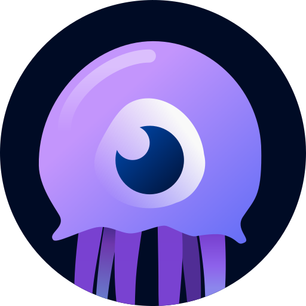

  <h1>OmniFetch Documentation</h1>
  
<em>Comprehensive monitoring and management for your media services</em>

Welcome to the documentation for **OmniFetch** - a native SwiftUI application that provides unified monitoring and management for your entire media stack.

  

    <!-- Images will be dynamically loaded -->
  

  

    <button class="carousel-btn carousel-prev" aria-label="Previous image">‹</button>
    <button class="carousel-btn carousel-next" aria-label="Next image">›</button>
  

  

## Overview

OmniFetch is a powerful iOS application designed to streamline your media service management.
With native SwiftUI interfaces, CloudKit sync, and real-time notifications, you can monitor your
services from anywhere. Support for iPad, Apple TV, and Mac is coming soon.

- **Native Experience**

    ---

    Built with SwiftUI for optimal performance on all Apple platforms. Follows Apple's Human Interface Guidelines for familiar, intuitive interactions.

- **Cross-Device Sync**

    ---

    CloudKit integration keeps your configurations synchronised across all your Apple devices.
Currently supports iPhone, with iPad, Apple TV, and Mac support coming soon.

- **Real-Time Alerts**

    ---

    Webhook-powered push notifications deliver instant alerts about downloads, requests, and system health directly to your devices.

- **Comprehensive Monitoring**

    ---

    Monitor download queues, system health, user requests, and library statistics across all your media services from a single interface.

## Supported Services

OmniFetch integrates seamlessly with these popular media services:

| Service | Type | Features |
|---------|------|----------|
|  [Sonarr](services/service-sonarr/index.md) | TV Shows | Queue monitoring, calendar view, automatic webhooks |
|  [Radarr](services/radarr/index.md) | Movies | Library management, download tracking, health monitoring |
|  [Lidarr](services/lidarr/index.md) | Music | Album monitoring, artist management, release tracking |
|  [Jellyseerr](services/jellyseerr/index.md) | Requests | Request approval, user management, issue tracking |
|  [SABnzbd](services/sabnzbd/index.md) | Downloads | Queue management, completion tracking, system alerts |

## Key Features

=== "Core Features"

    - **Real-time monitoring** of all your services
    - **CloudKit sync** across all your devices
    - **Push notifications** for important events
    - **Native SwiftUI** interface optimised for each platform

=== "Advanced Features"

    - **Home screen widgets** for quick status checks
    - **Webhook integration** for instant notifications
    - **Dark mode** support with system integration
    - **Full accessibility** support with VoiceOver

=== "Platform Features"

    - **iPhone optimisation** with full iOS integration
    - **iPad support** coming soon with split-view and multitasking
    - **Apple TV interface** coming soon with remote navigation
    - **Mac Catalyst** support coming soon for desktop usage

## Getting Started

- [**Installation**](app/installation.md)

    ---

    Download and install OmniFetch on your iPhone. Currently available for iOS 17.0+, with iPad, Apple TV, and Mac support coming soon.

- [**Initial Setup**](app/settings/initial-setup.md)

    ---

    Get up and running in minutes with our step-by-step setup guide. Configure your first service and test notifications.

- [**Configuration**](app/configuration.md)

    ---

    Comprehensive configuration guide including webhook setup, CloudKit sync, and advanced notification settings.

## Platform Support

| Platform | Version | Status | Features |
|----------|---------|---------|----------|
| **iPhone** | iOS 17.0+ | **Available Now** | Full feature set, widgets, notifications |
| **iPad** | iPadOS 17.0+ | **Coming Soon** | Split-view, multitasking, larger layouts |
| **Apple TV** | tvOS 17.0+ | **Coming Soon** | Remote navigation, living room experience |
| **Mac** | macOS 14.0+ | **Coming Soon** | Catalyst app, desktop workflows |

## What Makes OmniFetch Special

OmniFetch delivers a premium experience with features that matter:

- **Lightning Fast** - Instant app launch and smooth scrolling throughout
- **Always in Sync** - Your settings automatically sync across all your Apple devices
- **Offline Ready** - Access your data even without an internet connection
- **Battery Friendly** - Efficient background updates that don't drain your battery

## Need Help?

- [**Troubleshooting**](troubleshooting/common-issues.md)

    ---

    Solutions to common issues with service connections, notifications, and sync problems.

- [**FAQ**](troubleshooting/faq.md)

    ---

    Frequently asked questions about setup, features, and best practices.

---
