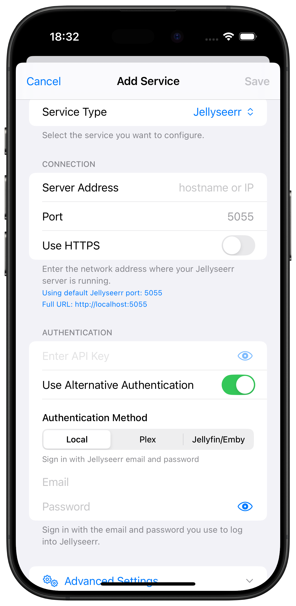
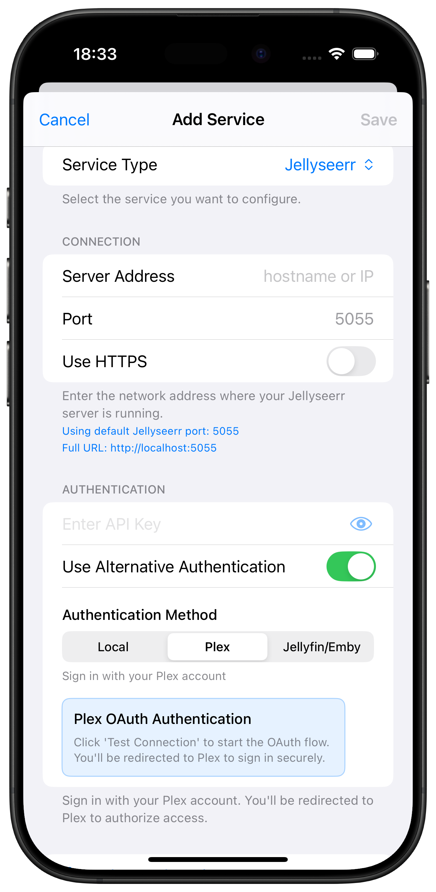
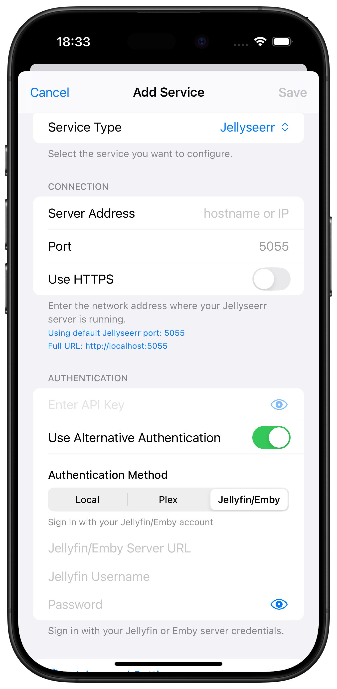
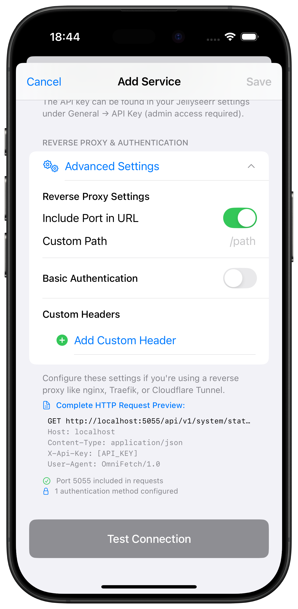

# Jellyseerr Setup

Complete guide for adding Jellyseerr to OmniFetch.

## Prerequisites

- Jellyseerr v1.0+ installed and running
- Access to Jellyseerr web interface
- Jellyseerr API key

## Adding Jellyseerr to OmniFetch

### Step 1: Locate Your API Key

1. Open your Jellyseerr web interface
2. Navigate to **Settings** → **General**
3. Under the **API** section, find **API Key**
4. Click **Generate** if no key exists
5. Copy the API key to your clipboard

!!! tip "API Key Security"
    Keep your API key secure. Never share it publicly or commit it to version control.

### Step 2: Add Service in OmniFetch

1. Open OmniFetch app
2. Go to **Settings**
3. Tap **"Add Service"**
4. From **Service Type** dropdown, select **Jellyseerr**
5. Choose your **Connection Type**:
   - **Local**: Direct connection to Jellyseerr
   - **Plex**: Connect through Plex integration
   - **Jellyfin**: Connect through Jellyfin integration

#### Local Connection

#### Plex Integration

#### Jellyfin Integration

### Step 3: Configure Connection

#### For Local Connection

##### Server Address

- Enter hostname or IP address only
- **Examples**:
  - Remote: `jellyseerr.mydomain.com`
  - Local: `192.168.1.100`
  - Docker: `jellyseerr` (container name)

##### Port

- Default Jellyseerr port: `5055`
- Change if using custom port

##### Use HTTPS

- Enable if using SSL/TLS
- Most local installations use HTTP

##### API Key

- Paste the API key you copied from Jellyseerr
- Ensure no extra spaces before or after

#### For Plex Integration

##### Plex Server Details

- Configure Plex server connection
- Jellyseerr requests will integrate with Plex

#### For Jellyfin Integration

##### Jellyfin Server Details

- Configure Jellyfin server connection
- Jellyseerr requests will integrate with Jellyfin

!!! note "Connection Examples"
    **Local HTTP**: Server Address: `192.168.1.100`, Port: `5055`, HTTPS: Off
    **Remote HTTPS**: Server Address: `jellyseerr.mydomain.com`, Port: `443`, HTTPS: On
    **Docker**: Server Address: `jellyseerr`, Port: `5055`, HTTPS: Off

### Step 4: Advanced Settings (Optional)

For additional configuration options, tap **Advanced Settings**:

**Advanced Options Include:**

- Custom timeout settings
- SSL certificate validation
- Request headers
- Base URL path
- Authentication method

!!! tip "Advanced Settings"
    Most users can skip advanced settings. Only configure these if you have specific requirements or custom Jellyseerr setup.

### Step 5: Test Connection

1. Tap **"Test Connection"**
2. Wait for the test to complete
3. Look for the success message

**If test succeeds:**

- ✅ Connection established
- ✅ API key valid
- ✅ Jellyseerr version compatible

**If test fails:**

- ❌ Check URL format and accessibility
- ❌ Verify API key is correct
- ❌ Ensure Jellyseerr is running

### Step 6: Save Configuration

1. Once test passes, tap **"Save"**
2. Jellyseerr will appear in your services list
3. Initial data sync will begin

## Post-Setup Configuration

### Enable Notifications (Beta)

If you have beta access:

1. Go to **Settings** → **Notification Settings** → **Push Notifications**
2. Enter your **Private Beta Key**
3. Save to enable webhook notifications

### Generate Webhook ID

For webhook notifications, you need a unique ID:

1. Go to **Settings** → **Developer**
2. Tap **Generate ID for Service**
3. Select **Jellyseerr**
4. Copy the generated ID
5. Configure webhook in Jellyseerr (see [webhooks guide](webhooks.md))

### Configure Refresh Intervals

1. Open Jellyseerr service in OmniFetch
2. Tap settings icon
3. Adjust refresh intervals:
   - Requests: 5-15 minutes
   - Activity: 10-30 minutes

### Set Notification Preferences

1. Go to Jellyseerr notification settings
2. Enable desired events:
   - Request Approved ✅
   - Request Available ✅
   - Request Declined
   - New Request (if admin)

!!! tip "Push Notification Setup"
    For detailed webhook and notification configuration for Jellyseerr, see the [Jellyseerr Webhooks Guide](webhooks.md).

## Request Management

### View Requests

1. Tap Jellyseerr service in OmniFetch
2. Browse pending, approved, and available requests
3. Filter by type (movies/TV shows)
4. Search for specific requests

### Request Actions

**For Administrators:**

- Approve pending requests
- Decline requests with reason
- View request details and comments

**For Users:**

- View your submitted requests
- Check approval status
- See availability notifications

## Verification Steps

After setup, verify everything works:

1. **Check Status Indicator:**
   - Green = Connected
   - Yellow = Warning
   - Red = Error

2. **View Requests:**
   - Pull to refresh
   - Check recent requests

3. **Test Notifications:**
   - Submit a test request
   - Verify push notification received

4. **Check Statistics:**
   - View request counts
   - Verify data accuracy

## Next Steps

- [Configure webhook notifications](webhooks.md)
- [Troubleshoot issues](../../troubleshooting/common-issues.md)
