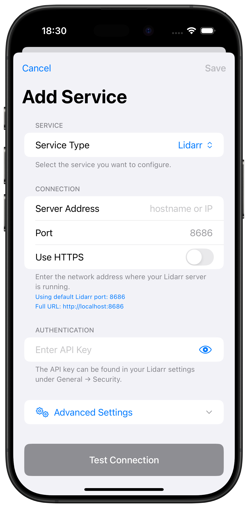
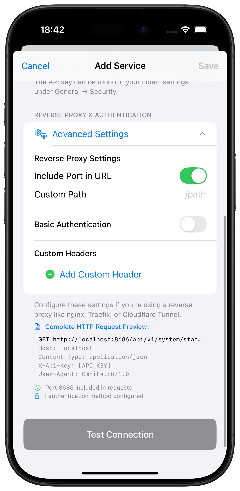

# Lidarr Setup

Complete guide for adding Lidarr to OmniFetch.

## Prerequisites

- Lidarr v1.0+ installed and running
- Access to Lidarr web interface
- Lidarr API key

## Adding Lidarr to OmniFetch

### Step 1: Locate Your API Key

1. Open your Lidarr web interface
2. Navigate to **Settings** → **General**
3. Under the **Security** section, find **API Key**
4. Click **Show** if the key is hidden
5. Copy the API key to your clipboard

!!! tip "API Key Security"
    Keep your API key secure. Never share it publicly or commit it to version control.

### Step 2: Add Service in OmniFetch

1. Open OmniFetch app
2. Go to **Settings**
3. Tap **"Add Service"**
4. From **Service Type** dropdown, select **Lidarr**

### Step 3: Configure Connection

Enter your Lidarr connection details:

#### Server Address

- Enter hostname or IP address only
- **Examples**:
  - Remote: `lidarr.mydomain.com`
  - Local: `192.168.1.100`
  - Docker: `lidarr` (container name)

#### Port

- Default Lidarr port: `8686`
- Change if using custom port

#### Use HTTPS

- Enable if using SSL/TLS
- Most local installations use HTTP

#### API Key

- Paste the API key you copied from Lidarr
- Ensure no extra spaces before or after

!!! note "Connection Examples"
    - **Local HTTP**: Server Address: `192.168.1.100`, Port: `8686`, HTTPS: Off
    - **Remote HTTPS**: Server Address: `lidarr.mydomain.com`, Port: `443`, HTTPS: On
    - **Docker**: Server Address: `lidarr`, Port: `8686`, HTTPS: Off

### Step 4: Advanced Settings (Optional)

For additional configuration options, tap **Advanced Settings**:

**Advanced Options Include:**

- Custom timeout settings
- SSL certificate validation
- Request headers
- Base URL path
- Authentication method

!!! tip "Advanced Settings"
    Most users can skip advanced settings. Only configure these if you have specific requirements or custom Lidarr setup.

### Step 5: Test Connection

1. Tap **"Test Connection"**
2. Wait for the test to complete
3. Look for the success message

**If test succeeds:**

- ✅ Connection established
- ✅ API key valid
- ✅ Lidarr version compatible

**If test fails:**

- ❌ Check URL format and accessibility
- ❌ Verify API key is correct
- ❌ Ensure Lidarr is running

### Step 6: Save Configuration

1. Once test passes, tap **"Save"**
2. Lidarr will appear in your services list
3. Initial data sync will begin

## Post-Setup Configuration

### Enable Notifications (Beta)

If you have beta access:

1. Go to **Settings** → **Notification Settings** → **Push Notifications**
2. Enter your **Private Beta Key**
3. Save to enable webhook notifications
4. Lidarr webhooks are configured automatically

### Configure Refresh Intervals

1. Open Lidarr service in OmniFetch
2. Tap settings icon
3. Adjust refresh intervals:
   - Queue: 5-15 minutes
   - Calendar: 30-60 minutes
   - Artists: 60+ minutes

### Set Notification Preferences

1. Go to Lidarr notification settings
2. Enable desired events:
   - Album Downloaded ✅
   - Album Grabbed
   - Quality Upgraded
   - Health Issues ✅
   - Artist Deleted

!!! tip "Push Notification Setup"
    For detailed webhook and notification configuration for Lidarr, see the [Lidarr Webhooks Guide](webhooks.md).

## Verification Steps

After setup, verify everything works:

1. **Check Status Indicator:**
   - Green = Connected
   - Yellow = Warning
   - Red = Error

2. **View Queue:**
   - Pull to refresh
   - Check active downloads

3. **Test Notifications:**
   - Trigger test from Lidarr
   - Verify push notification received

4. **Review Calendar:**
   - Check upcoming releases
   - Verify data accuracy

## Next Steps

- [Configure webhook notifications](webhooks.md)
- [Troubleshoot issues](../../troubleshooting/common-issues.md)
