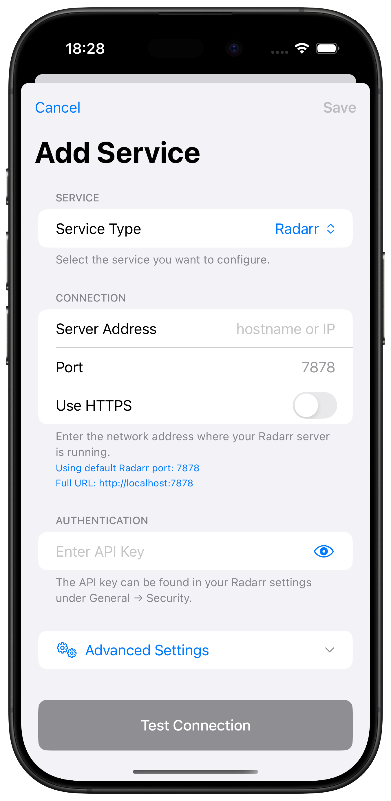
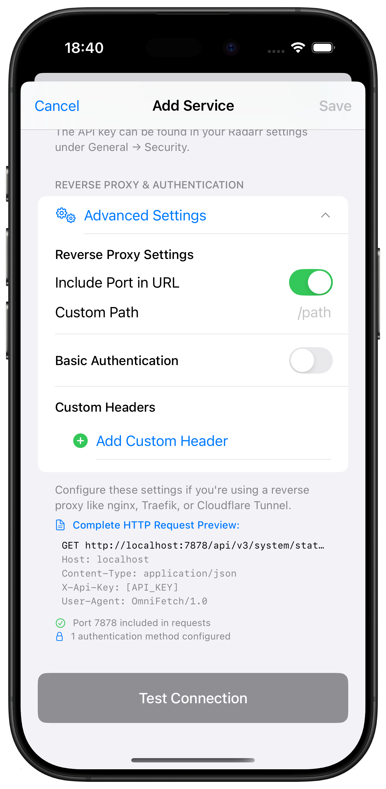

# Radarr Setup

Complete guide for adding Radarr to OmniFetch.

## Prerequisites

- Radarr v3.0+ installed and running
- Access to Radarr web interface
- Radarr API key

## Adding Radarr to OmniFetch

### Step 1: Locate Your API Key

1. Open your Radarr web interface
2. Navigate to **Settings** → **General**
3. Under the **Security** section, find **API Key**
4. Click **Show** if the key is hidden
5. Copy the API key to your clipboard

!!! tip "API Key Security"
    Keep your API key secure. Never share it publicly or commit it to version control.

### Step 2: Add Service in OmniFetch

1. Open OmniFetch app
2. Go to **Settings**
3. Tap **"Add Service"**
4. From **Service Type** dropdown, select **Radarr**

### Step 3: Configure Connection

Enter your Radarr connection details:

#### Server Address

- Enter hostname or IP address only
- **Examples**:
  - Remote: `radarr.mydomain.com`
  - Local: `192.168.1.100`
  - Docker: `radarr` (container name)

#### Port

- Default Radarr port: `7878`
- Change if using custom port

#### Use HTTPS

- Enable if using SSL/TLS
- Most local installations use HTTP

#### API Key

- Paste the API key you copied from Radarr
- Ensure no extra spaces before or after

!!! note "Connection Examples"
    - **Local HTTP**: Server Address: `192.168.1.100`, Port: `7878`, HTTPS: Off
    - **Remote HTTPS**: Server Address: `radarr.mydomain.com`, Port: `443`, HTTPS: On
    - **Docker**: Server Address: `radarr`, Port: `7878`, HTTPS: Off

### Step 4: Advanced Settings (Optional)

For additional configuration options, tap **Advanced Settings**:

**Advanced Options Include:**
- Custom timeout settings
- SSL certificate validation
- Request headers
- Base URL path
- Authentication method

!!! tip "Advanced Settings"
    Most users can skip advanced settings. Only configure these if you have specific requirements or custom Radarr setup.

### Step 5: Test Connection

1. Tap **"Test Connection"**
2. Wait for the test to complete
3. Look for the success message

**If test succeeds:**
- ✅ Connection established
- ✅ API key valid
- ✅ Radarr version compatible

**If test fails:**
- ❌ Check URL format and accessibility
- ❌ Verify API key is correct
- ❌ Ensure Radarr is running

### Step 6: Save Configuration

1. Once test passes, tap **"Save"**
2. Radarr will appear in your services list
3. Initial data sync will begin

## Post-Setup Configuration

### Enable Notifications (Beta)

If you have beta access:

1. Go to **Settings** → **Notification Settings** → **Push Notifications**
2. Enter your **Private Beta Key**
3. Save to enable webhook notifications
4. Radarr webhooks are configured automatically

### Configure Refresh Intervals

1. Open Radarr service in OmniFetch
2. Tap settings icon
3. Adjust refresh intervals:
   - Queue: 5-15 minutes
   - Calendar: 30-60 minutes
   - Movies: 60+ minutes

### Set Notification Preferences

1. Go to Radarr notification settings
2. Enable desired events:
   - Movie Downloaded ✅
   - Movie Grabbed
   - Quality Upgraded
   - Health Issues ✅
   - Movie Deleted

## Verification Steps

After setup, verify everything works:

1. **Check Status Indicator:**
   - Green = Connected
   - Yellow = Warning
   - Red = Error

2. **View Queue:**
   - Pull to refresh
   - Check active downloads

3. **Test Notifications:**
   - Trigger test from Radarr
   - Verify push notification received

4. **Review Calendar:**
   - Check upcoming releases
   - Verify data accuracy

## Next Steps

- [Configure webhook notifications](webhooks.md)
- [Troubleshoot issues](../../troubleshooting/common-issues.md)