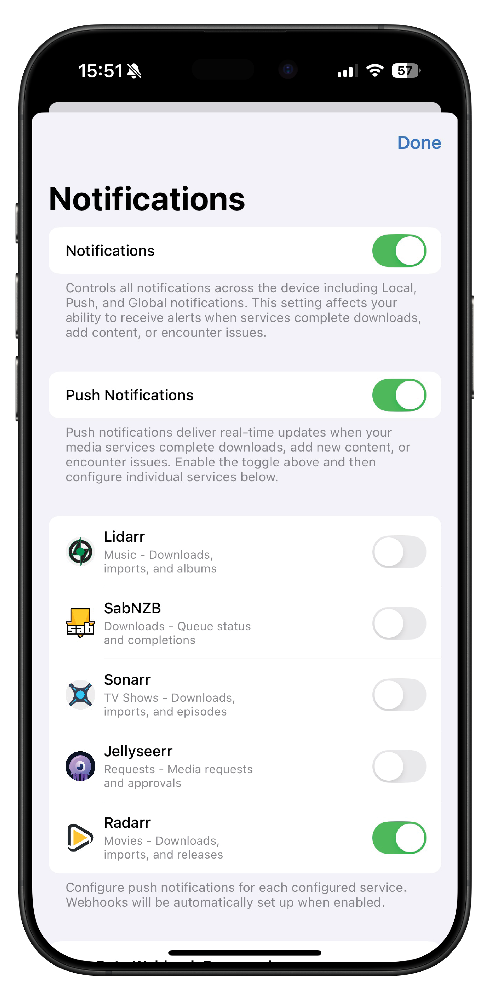
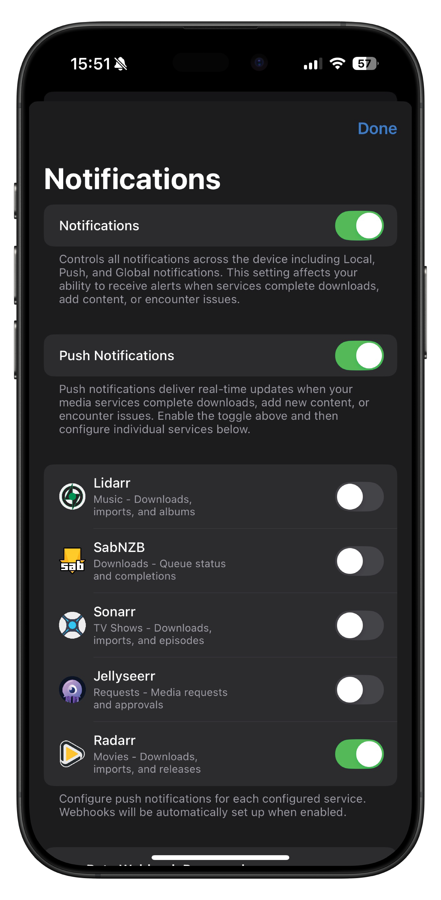

# Radarr Webhook Notifications

Configure push notifications for Radarr events using webhooks (beta feature).

## Overview

Webhook notifications provide real-time push notifications when events occur in Radarr. This feature requires beta access.

## Prerequisites

- OmniFetch app with Radarr configured
- Private beta key from Discord
- iOS push notifications enabled

## Setup Process

### Step 1: Enable Beta Access

1. Open OmniFetch
2. Go to **Settings** → **Notification Settings** → **Push Notifications**
3. Enter your **Private Beta Key** in the designated field
4. Tap **Save** - look for green confirmation
5. Beta features are now activated
6. Enable the button to on

  
  

### Step 2: Automatic Webhook Configuration

Once beta access is enabled:

1. **Add or Update Radarr:**
   - If adding new: Complete normal setup process
   - If existing: Edit and re-save the service

2. **Automatic Process:**
   - OmniFetch registers your device for push notifications
   - Creates webhook connection in Radarr
   - Configures all supported events
   - No manual configuration needed

### Step 3: Verify Webhook Creation

1. Open Radarr web interface
2. Navigate to **Settings** → **Connect** → **Connections**
3. Look for **"OmniFetch"** connection
4. Verify it shows as enabled

### Step 4: Test Notifications

1. In Radarr connections, find OmniFetch
2. Click **Test** button
3. You should receive a push notification
4. If successful, setup is complete

## Supported Events

### Core Events

#### Download/Import Completed

- **Event**: Movie successfully downloaded and imported
- **Includes**: Quality upgrades
- **Notification**: "Movie Name (2023) downloaded successfully"

#### Media Grabbed

- **Event**: Movie grabbed from indexer
- **Notification**: "Movie Name (2023) grabbed from IndexerName"

#### Test Notification

- **Event**: Manual test from Radarr
- **Notification**: "Test notification from Radarr"

### File Management Events

#### Files Renamed

- **Event**: Movie files renamed/organised
- **Notification**: "Movie Name (2023) renamed"

#### Movie Deleted

- **Event**: Movie file deleted from disk
- **Notification**: "Movie Name (2023) deleted"

### Library Events

#### Movie Deleted

- **Event**: Movie removed from Radarr
- **Notification**: "Movie Name (2023) removed from library"

### System Events

#### Health Issues

- **Event**: Radarr detects system problems
- **Priority**: High
- **Examples**:
  - "Unable to connect to download client"
  - "Indexer unavailable"
  - "Root folder missing"

#### Application Updates

- **Event**: Radarr update available
- **Notification**: "Radarr update available: v4.0.9"

## Notification Management

### Configure Event Types

1. In OmniFetch, go to Radarr settings
2. Tap **Notification Settings**
3. Toggle individual events on/off
4. Save preferences

### Recommended Settings

**Essential Notifications:**

- ✅ Download/Import Completed
- ✅ Health Issues
- ✅ Download Failed

**Optional Notifications:**

- ⚪ Media Grabbed
- ⚪ Files Renamed
- ⚪ Quality Upgraded

**Avoid Overload:**

- ❌ Test notifications (after initial test)
- ❌ Verbose file operations

### Notification Sounds

Configure custom sounds:

1. iOS Settings → Notifications → OmniFetch
2. Choose notification sound
3. Or set per-service sounds in app

## Troubleshooting

### No Webhook in Radarr

**Issue**: OmniFetch connection not appearing in Radarr

**Solutions:**

1. Verify beta key is saved
2. Edit and re-save Radarr in OmniFetch
3. Check Radarr API permissions
4. Restart Radarr service

### Test Fails

**Issue**: Test notification doesn't arrive

**Check:**

- iOS notification permissions
- Beta key validity
- Internet connectivity
- Radarr can reach webhook server

### Duplicate Notifications

**Issue**: Receiving multiple notifications for same event

**Fix:**

1. Remove any manual webhook configurations
2. Ensure only one OmniFetch connection exists
3. Disable Radarr's built-in notifications

### 403 Forbidden Error

**Issue**: Webhook returns authentication error

**Solutions:**

- Re-enter beta key in OmniFetch
- Generate new webhook (if using manual setup)
- Contact support for key verification

## Advanced Configuration

### Performance Optimization

**Best Practices:**

- Limit notifications to essential events
- Use quiet hours for overnight periods
- Group notifications when possible
- Monitor webhook response times

### Debug Information

For troubleshooting:

1. Go to **Settings** → **Developer**
2. Enable **Debug Logging**
3. Check webhook status and errors
4. Share logs with support if needed

## Beta Limitations

Current beta limitations:

- Webhook URL changes require reconfiguration
- Some events may have delays
- Rate limiting during high activity
- Beta key required for all features

## FAQ

**Q: Do I need to configure anything in Radarr?**
A: No, OmniFetch handles everything automatically once beta key is entered.

**Q: Can I customise the webhook URL?**
A: No, the webhook URL is managed by OmniFetch.

**Q: Will webhooks work without beta key?**
A: No, webhook notifications require beta access.

**Q: How do I disable webhooks?**
A: Remove beta key or disable notifications in settings.