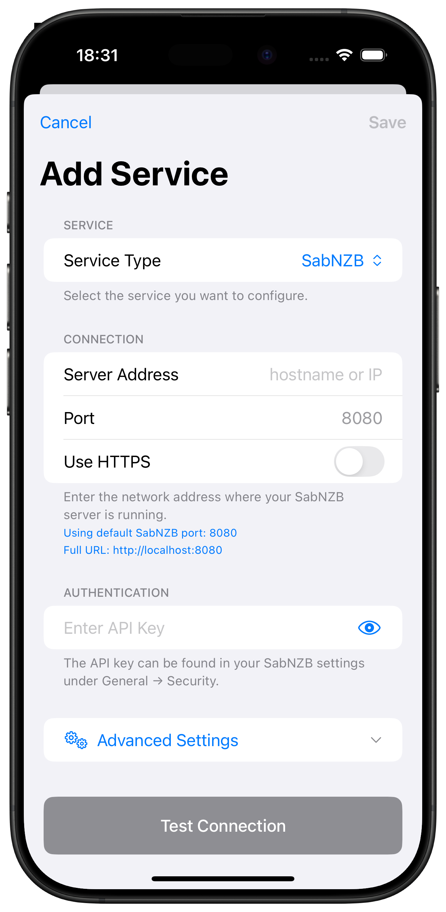
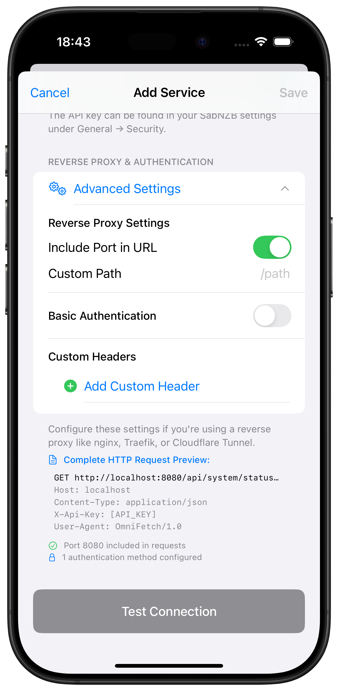

# SABnzbd Setup

Complete guide for adding SABnzbd to OmniFetch.

## Prerequisites

- SABnzbd v3.0+ installed and running
- Access to SABnzbd web interface
- SABnzbd API key

## Adding SABnzbd to OmniFetch

### Step 1: Locate Your API Key

1. Open your SABnzbd web interface
2. Navigate to **Config** → **General**
3. Under the **Security** section, find **API Key**
4. If empty, click **Generate New Key**
5. Copy the API key to your clipboard

!!! tip "API Key Security"
    Keep your API key secure. Never share it publicly or commit it to version control.

### Step 2: Add Service in OmniFetch

1. Open OmniFetch app
2. Go to **Settings**
3. Tap **"Add Service"**
4. From **Service Type** dropdown, select **SABnzbd**

### Step 3: Configure Connection

Enter your SABnzbd connection details:

#### Server Address

- Enter hostname or IP address only
- **Examples**:
  - Remote: `sabnzbd.mydomain.com`
  - Local: `192.168.1.100`
  - Docker: `sabnzbd` (container name)

#### Port

- Default SABnzbd port: `8080`
- Change if using custom port

#### Use HTTPS

- Enable if using SSL/TLS
- Most local installations use HTTP

#### API Key

- Paste the API key you copied from SABnzbd
- Ensure no extra spaces before or after

!!! note "Connection Examples"
    - **Local HTTP**: Server Address: `192.168.1.100`, Port: `8080`, HTTPS: Off
    - **Remote HTTPS**: Server Address: `sabnzbd.mydomain.com`, Port: `443`, HTTPS: On
    - **Docker**: Server Address: `sabnzbd`, Port: `8080`, HTTPS: Off

### Step 4: Advanced Settings (Optional)

For additional configuration options, tap **Advanced Settings**:

**Advanced Options Include:**
- Custom timeout settings
- SSL certificate validation
- Request headers
- Base URL path
- Authentication method

!!! tip "Advanced Settings"
    Most users can skip advanced settings. Only configure these if you have specific requirements or custom SABnzbd setup.

### Step 5: Test Connection

1. Tap **"Test Connection"**
2. Wait for the test to complete
3. Look for the success message

**If test succeeds:**
- ✅ Connection established
- ✅ API key valid
- ✅ SABnzbd version compatible

**If test fails:**
- ❌ Check URL format and accessibility
- ❌ Verify API key is correct
- ❌ Ensure SABnzbd is running

### Step 6: Save Configuration

1. Once test passes, tap **"Save"**
2. SABnzbd will appear in your services list
3. Initial data sync will begin

## Post-Setup Configuration

### Enable Notifications (Beta)

If you have beta access:

1. Go to **Settings** → **Notification Settings** → **Push Notifications**
2. Enter your **Private Beta Key**
3. Save to enable webhook notifications

### Generate Webhook ID

For webhook notifications, you need a unique ID:

1. Go to **Settings** → **Developer**
2. Tap **Generate ID for Service**
3. Select **SABnzbd**
4. Copy the generated ID
5. Configure webhook script in SABnzbd (see [webhooks guide](webhooks.md))

### Configure Refresh Intervals

1. Open SABnzbd service in OmniFetch
2. Tap settings icon
3. Adjust refresh intervals:
   - Queue: 5-15 seconds (for active downloads)
   - History: 5-15 minutes
   - Statistics: 30-60 minutes

### Set Notification Preferences

1. Go to SABnzbd notification settings
2. Enable desired events:
   - Download Complete ✅
   - Download Failed ✅
   - Queue Complete ✅
   - Disk Space Low ✅

!!! tip "Push Notification Setup"
    For detailed webhook and notification configuration for SABnzbd, see the [SABnzbd Webhooks Guide](webhooks.md).

## Queue Management

### Monitor Downloads

1. Tap SABnzbd service in OmniFetch
2. View active downloads with:
   - Progress percentages
   - Download speeds
   - Time remaining
   - File sizes

### Queue Controls

**Available Actions:**
- Pause/Resume individual downloads
- Delete items from queue
- Change download priority
- View download details

### Speed Limiting

Control bandwidth usage:
- Set speed limits for different times
- Pause all downloads
- Resume with speed restrictions

## Verification Steps

After setup, verify everything works:

1. **Check Status Indicator:**
   - Green = Connected and active
   - Yellow = Connected but paused
   - Red = Connection error

2. **View Queue:**
   - Pull to refresh
   - Check active downloads

3. **Test Notifications:**
   - Add a small test download
   - Verify completion notification

4. **Check History:**
   - View completed downloads
   - Verify data accuracy

## Next Steps

- [Configure webhook notifications](webhooks.md)
- [Troubleshoot issues](../../troubleshooting/common-issues.md)