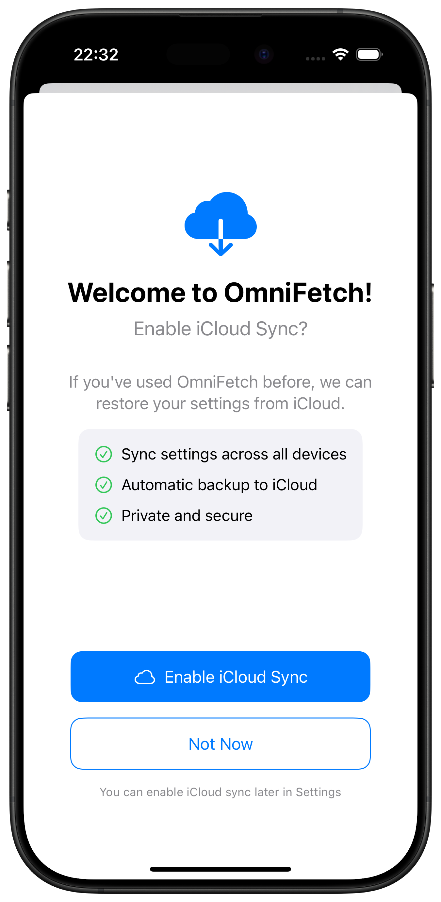
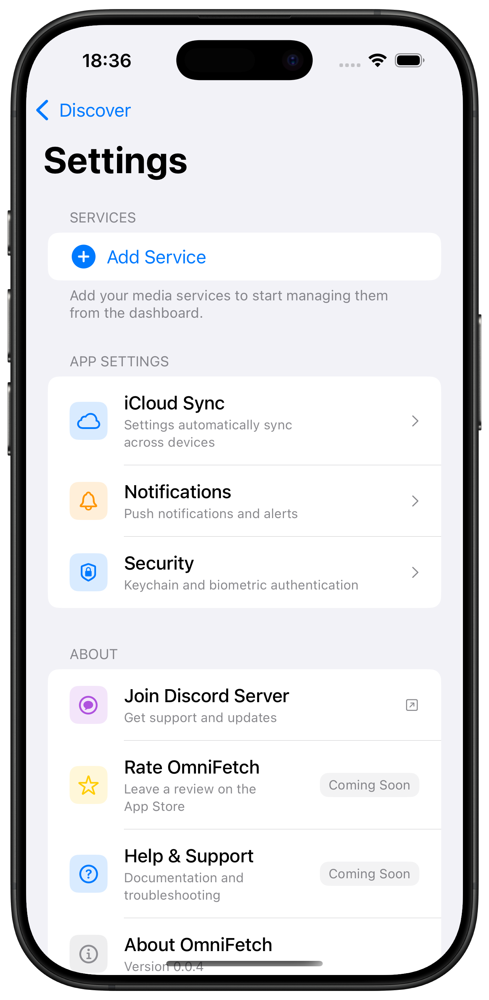

# Quick Start Guide

Get up and running with OmniFetch in just a few minutes! This guide covers the essential steps to monitor your first service.

## Prerequisites

Before starting, ensure you have:

- OmniFetch installed on your device
- At least one media service running (Sonarr, Radarr, Lidarr, etc.)
- The API key for your service
- Network access to your service

## Step 1: Initial App Setup

1. **Open OmniFetch** for the first time
2. **iCloud Sync Setup**: You'll see the welcome screen offering iCloud sync
   - **Enable iCloud Sync**: Recommended to sync settings across devices
   - **Not Now**: You can skip and use local storage only

The onboarding screen highlights the benefits of iCloud sync:

- ✅ Sync settings across all devices
- ✅ Automatic backup to iCloud  
- ✅ Private and secure

## Step 2: Add Your First Service

### Quick Setup

1. **Tap "Add Service"** on the main screen
2. **Select Service Type** from the list:
   - Sonarr (TV shows)
   - Radarr (Movies)  
   - Lidarr (Music)
   - Jellyseerr (Requests)
   - SABnzbd (Downloads)
   - And more coming soon...

3. **Enter Service Details**:
   - **Server Address**: Enter hostname or IP address only (no http/https)
   - **Port**: Default port is pre-filled (e.g., 8989 for Sonarr)
   - **Use HTTPS**: Toggle on/off based on your setup
   - **API Key**: Copy from your service's settings

### Example Configuration

**For Sonarr:**

- **Server Address**: `sonarr.mydomain.com` or `192.168.1.100`
- **Port**: `8989` (default, pre-filled)
- **Use HTTPS**: Enable for SSL/TLS connections
- **API Key**: `abc123def456ghi789` (from Sonarr → Settings → General)

## Step 3: Test Your Connection

1. **Tap "Test Connection"** after entering details
2. **Wait for Result**:
   - **Success**: Connection working, proceed to save
   - **Failed**: Check URL and API key, try again
3. **Save Service** once test passes

## Step 4: Enable Notifications

1. **iOS Notification Prompt**: Tap "Allow" if prompted
2. **In OmniFetch**:
   - Go to Settings → Notifications
   - Toggle "Enable Notifications" ON
   - Select events you want to be notified about

## Step 5: Test Everything

### Test Service Connection

1. **Main Screen**: Your service should show with a green status
2. **Tap Service**: View recent activity and queue information
3. **Refresh**: Pull down to refresh data

### Test Notifications

1. **Go to your service's web interface**
2. **Navigate to**: Settings → Connect → Connections
3. **Find "OmniFetch"** webhook connection
4. **Click "Test"** - you should get a notification on your device

## Step 6: Add More Services (Optional)

Repeat the process for additional services:

1. Tap "Add Service" to add another service
2. Select different service type
3. Configure and test
4. Save when working

## Common First-Time Issues

### Connection Problems

**"Connection Failed":**

- Double-check URL format: `http://` or `https://`
- Verify service is running and accessible
- Try accessing URL in your device's web browser

**"Unauthorized":**

- API key may be incorrect or expired
- Copy API key again from service settings
- Ensure no extra spaces when pasting

### Notification Issues

**Not receiving test notifications:**

- Check iOS Settings → Notifications → OmniFetch
- Ensure "Allow Notifications" is enabled
- Try airplane mode on/off to refresh connection

**Webhook test fails:**

- Service may not have internet access
- Webhook creation might be in progress (wait 30 seconds)
- Try removing and re-adding the service

## Next Steps

Once your first service is working:

### Explore Features

- **Widgets**: Add OmniFetch widgets to your home screen
- **CloudKit Sync**: Set up additional devices  
- **Advanced Notifications**: Fine-tune notification preferences
- **Service Management**: Add remaining services in your stack

### Customize Your Setup

- **Organize Services**: Rename services with descriptive names
- **Notification Sounds**: Set different sounds for different services
- **Refresh Intervals**: Adjust how often data updates
- **Quiet Hours**: Configure do-not-disturb periods

### Learn More

- Read the full [Configuration Guide](configuration.md) for advanced setup
- Check out [Service Guides](../services/index.md) for service-specific tips
- Browse [Features](../features/notifications.md) to discover more capabilities

## Success Checklist

After completing quick start, you should have:

- **✓** OmniFetch installed and permissions granted
- **✓** At least one service configured and connected
- **✓** Service showing green status on main screen
- **✓** Test notification received successfully
- **✓** Basic understanding of adding more services

## Need Help?

If you encounter issues during setup:

1. **Check [Troubleshooting](../troubleshooting/common-issues.md)** for common solutions
2. **Verify Service Settings**: Ensure your media service is properly configured
3. **Test Network Access**: Try accessing service URL from your device's browser
4. **Review [Configuration Guide](configuration.md)** for detailed setup instructions

You're now ready to monitor your media services with OmniFetch!